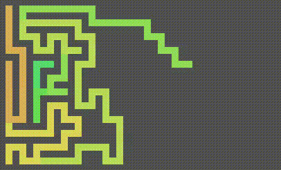

# 迷路生成・迷路解きプログラム




youtube 動画はこちら
https://youtu.be/krAe6bm9SFY


## 実行方法
```
> python maze.py
```

## 原理

迷路生成・迷路解き、どちらも基本的には同じアルゴリズム。

できるだけ道を伸ばし、伸ばせなくなったら、その道を逆にもどり、分岐できるところを見つけて、そこから伸ばす。

この方法で、道をさかのぼりし、開始地点までもどったら終了とする。


